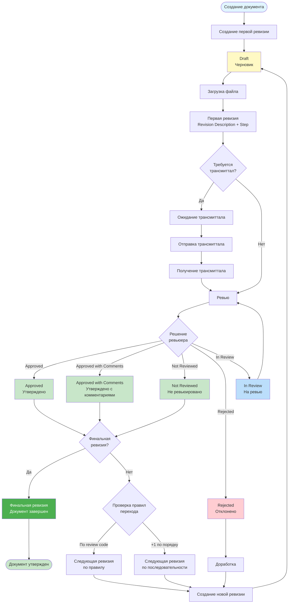
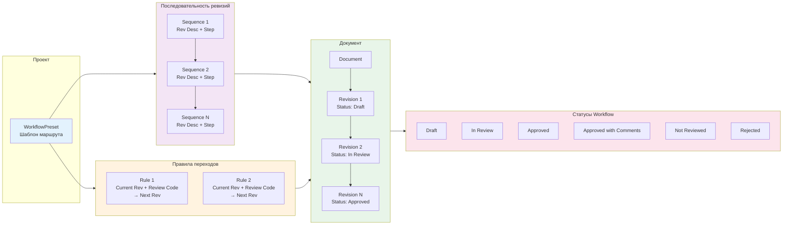
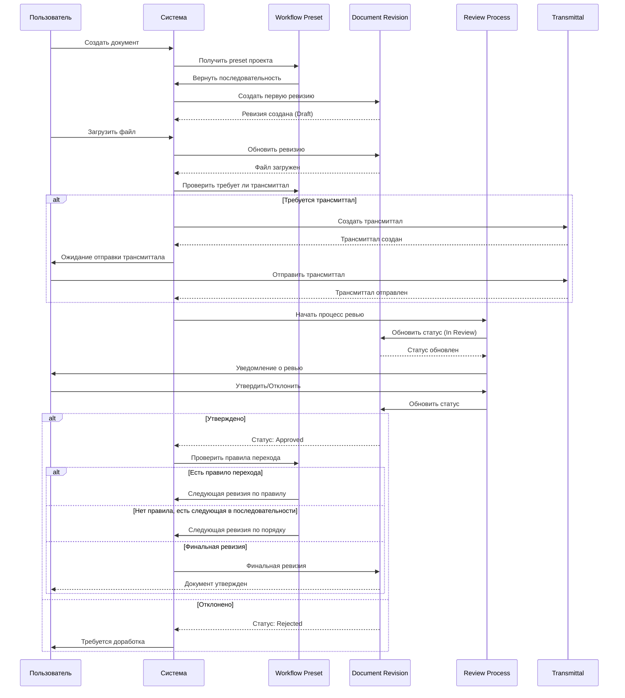
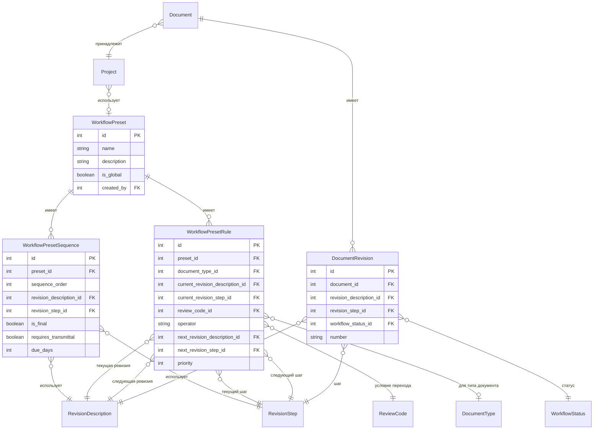
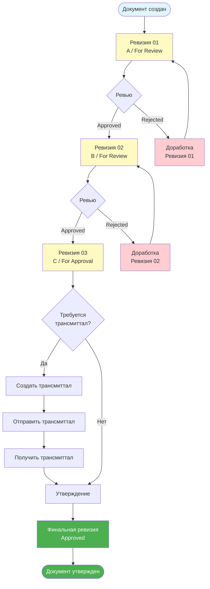

# Диаграмма маршрута документа (Document Workflow)

## Общая схема маршрута согласования документа

## Детальная схема компонентов системы

## Процесс создания и обработки ревизий

## Структура данных Workflow Preset

## Пример типичного маршрута документа

## Описание компонентов

### WorkflowPreset (Шаблон маршрута)
- **Назначение**: Определяет общий маршрут согласования для проекта
- **Свойства**:
  - `name`: Название шаблона
  - `description`: Описание
  - `is_global`: Глобальный или пользовательский шаблон
  - `created_by`: Создатель шаблона

### WorkflowPresetSequence (Последовательность ревизий)
- **Назначение**: Определяет порядок ревизий в маршруте
- **Свойства**:
  - `sequence_order`: Порядок в последовательности
  - `revision_description_id`: Описание ревизии (A, B, C, и т.д.)
  - `revision_step_id`: Шаг ревизии (For Review, For Approval, и т.д.)
  - `is_final`: Является ли финальной ревизией
  - `requires_transmittal`: Требуется ли трансмиттал для этой ревизии
  - `due_days`: Количество дней на выполнение

### WorkflowPresetRule (Правила переходов)
- **Назначение**: Определяет условия перехода между ревизиями
- **Свойства**:
  - `current_revision_description_id`: Текущее описание ревизии
  - `current_revision_step_id`: Текущий шаг ревизии
  - `review_code_id`: Код ревью, который вызывает переход
  - `operator`: Оператор сравнения (equals, not_equals, in_list, not_in_list)
  - `next_revision_description_id`: Следующее описание ревизии
  - `next_revision_step_id`: Следующий шаг ревизии
  - `document_type_id`: Применяется к конкретному типу документа (опционально)
  - `priority`: Приоритет правила

### DocumentRevision (Ревизия документа)
- **Назначение**: Представляет конкретную ревизию документа
- **Свойства**:
  - `revision_description_id`: Описание ревизии
  - `revision_step_id`: Шаг ревизии
  - `workflow_status_id`: Статус в workflow
  - `number`: Номер ревизии (01, 02, 03, и т.д.)

### WorkflowStatus (Статусы)
- **Draft**: Черновик
- **In Review**: На ревью
- **Approved**: Утверждено
- **Approved with Comments**: Утверждено с комментариями
- **Not Reviewed**: Не ревьюировано
- **Rejected**: Отклонено

## Логика переходов

1. **По умолчанию**: Документ следует последовательности (WorkflowPresetSequence) по порядку
2. **По правилам**: Если есть правило (WorkflowPresetRule), которое соответствует текущей ревизии и review code, переход происходит согласно правилу
3. **Финальная ревизия**: Когда достигнута ревизия с `is_final = true` и она утверждена, документ считается завершенным
4. **Трансмиттал**: Если `requires_transmittal = true`, документ должен быть отправлен через трансмиттал перед утверждением

## Автоматические действия

- При создании первого утвержденного документа проект автоматически переходит из статуса "PLANNING" в "ACTIVE"
- При утверждении ревизии система проверяет правила перехода и создает следующую ревизию при необходимости
- При отклонении ревизии создается новая ревизия для доработки
